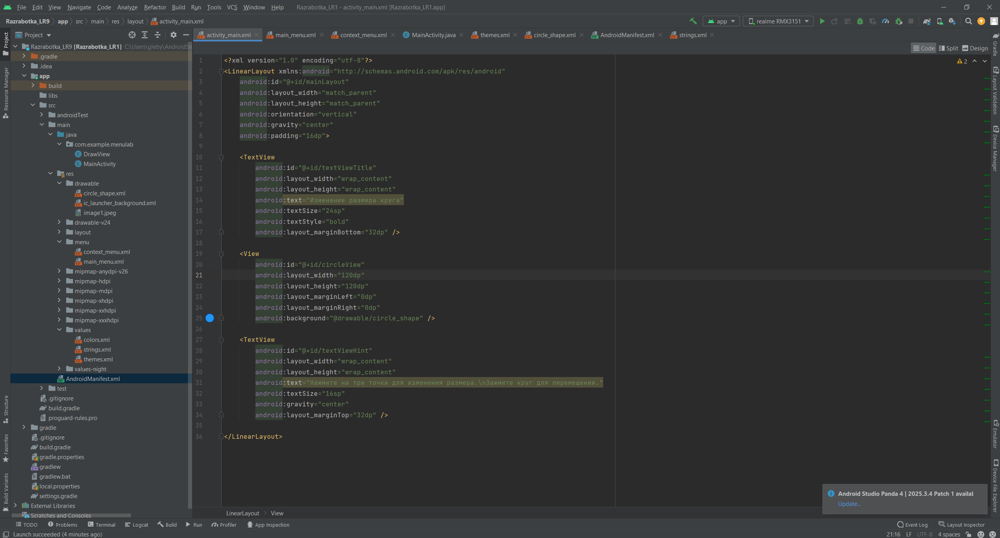
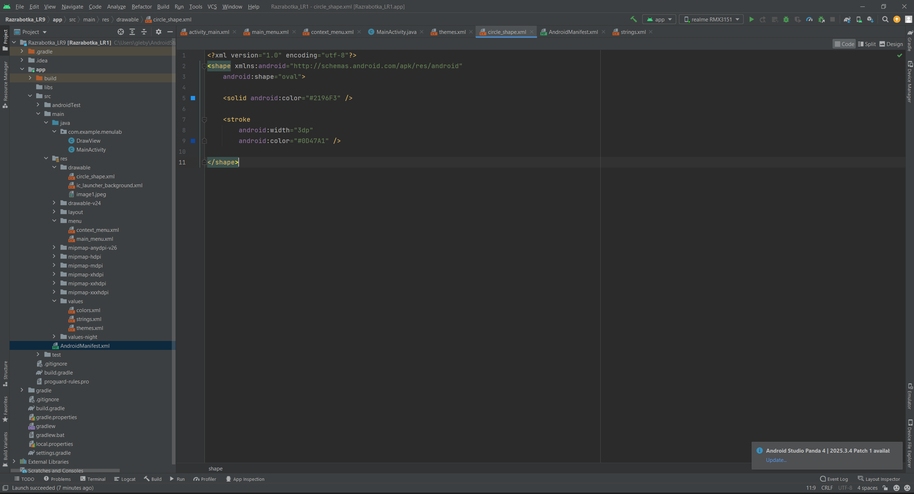
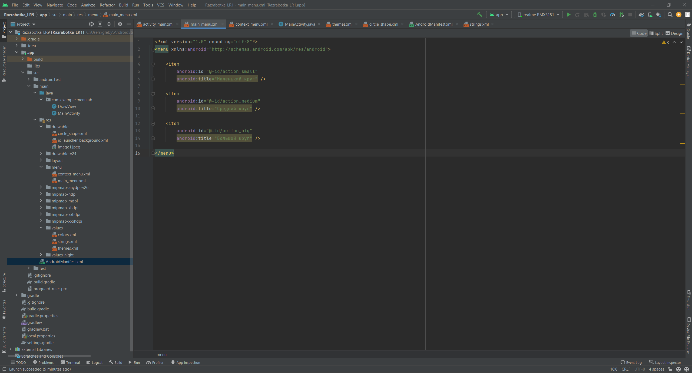
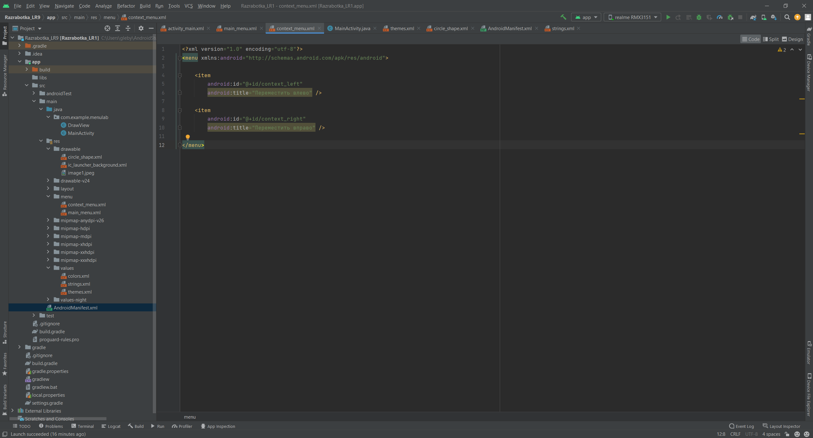
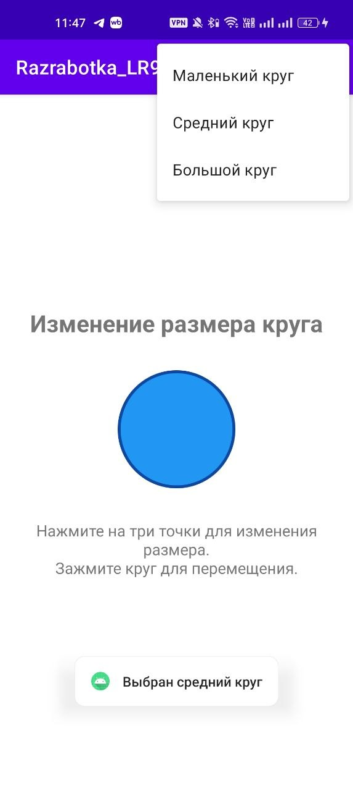

# Отчет

## Практическая работа №9

## Создание меню

**Выполнил:**  
Ржевский Константин Романович
**Курс:** 2  
**Группа:** ИНС-б-о-24-1

**Проверил:**   
Потапов И.Р. 

---

### Цель работы

Изучить способы создания и обработки событий от различных типов меню в Android: главного меню (OptionsMenu) и контекстного меню (ContextMenu). Научиться динамически изменять интерфейс приложения с помощью пунктов меню.

### Ход работы
1. Создадим новый проект MenuLab.
В файле activity_main.xml создадим интерфейс по моему варианту:
Главное меню: изменение размеров круга (маленький, средний, большой), нарисованного в ImageView или View.
Контекстное меню на этом элементе: "переместить влево", "переместить вправо" (изменять отступы).

*Рисунок 1. Создание интерфейса в activity_main.xml*

 

Также в папке /res/drawable создадим файл circle_shape.xml.
В нём мы пропишем наличие синнго круга, который отображается через обычный View.

*Рисунок 2. Создание и изменение файла circle_shape.xml*

2.  Создадим папку res/menu. В ней создадим файл main_menu.xml. Добавим три пункта меню согласно вашему варианту.

*Рисунок 3. Настройка файла main_menu.xml*

 

В MainActivity.java переопределим метод onCreateOptionsMenu для загрузки меню. Код MainActivity.java:

<pre>
package com.example.menulab;

import androidx.appcompat.app.AppCompatActivity;

import android.os.Bundle;
import android.view.ContextMenu;
import android.view.Menu;
import android.view.MenuItem;
import android.view.View;
import android.widget.LinearLayout;
import android.widget.Toast;

import com.example.razrabotka_lr1.R;

public class MainActivity extends AppCompatActivity {

    private View circleView;

    private int circleSizeDp = 120;
    private int leftMarginDp = 0;
    private int rightMarginDp = 0;

    @Override
    protected void onCreate(Bundle savedInstanceState) {
        super.onCreate(savedInstanceState);
        setContentView(R.layout.activity_main);

        circleView = findViewById(R.id.circleView);

        registerForContextMenu(circleView);
    }

    @Override
    public boolean onCreateOptionsMenu(Menu menu) {
        getMenuInflater().inflate(R.menu.main_menu, menu);
        return true;
    }

    @Override
    public boolean onOptionsItemSelected(MenuItem item) {
        int id = item.getItemId();

        if (id == R.id.action_small) {
            circleSizeDp = 80;
            changeCircleSize(circleSizeDp);
            Toast.makeText(this, "Выбран маленький круг", Toast.LENGTH_SHORT).show();
            return true;
        } else if (id == R.id.action_medium) {
            circleSizeDp = 120;
            changeCircleSize(circleSizeDp);
            Toast.makeText(this, "Выбран средний круг", Toast.LENGTH_SHORT).show();
            return true;
        } else if (id == R.id.action_big) {
            circleSizeDp = 180;
            changeCircleSize(circleSizeDp);
            Toast.makeText(this, "Выбран большой круг", Toast.LENGTH_SHORT).show();
            return true;
        }

        return super.onOptionsItemSelected(item);
    }

    private void changeCircleSize(int sizeDp) {
        int sizePx = dpToPx(sizeDp);

        LinearLayout.LayoutParams params = (LinearLayout.LayoutParams) circleView.getLayoutParams();
        params.width = sizePx;
        params.height = sizePx;

        circleView.setLayoutParams(params);
    }

    @Override
    public void onCreateContextMenu(ContextMenu menu, View v, ContextMenu.ContextMenuInfo menuInfo) {
        super.onCreateContextMenu(menu, v, menuInfo);

        if (v.getId() == R.id.circleView) {
            menu.setHeaderTitle("Перемещение круга");
            getMenuInflater().inflate(R.menu.context_menu, menu);
        }
    }

    @Override
    public boolean onContextItemSelected(MenuItem item) {
        int id = item.getItemId();

        if (id == R.id.context_left) {
            moveCircleLeft();
            Toast.makeText(this, "Круг перемещён влево", Toast.LENGTH_SHORT).show();
            return true;
        } else if (id == R.id.context_right) {
            moveCircleRight();
            Toast.makeText(this, "Круг перемещён вправо", Toast.LENGTH_SHORT).show();
            return true;
        }

        return super.onContextItemSelected(item);
    }

    private void moveCircleLeft() {
        leftMarginDp -= 30;
        rightMarginDp += 30;
        changeCircleMargins();
    }

    private void moveCircleRight() {
        leftMarginDp += 30;
        rightMarginDp -= 30;
        changeCircleMargins();
    }

    private void changeCircleMargins() {
        LinearLayout.LayoutParams params = (LinearLayout.LayoutParams) circleView.getLayoutParams();

        params.leftMargin = dpToPx(leftMarginDp);
        params.rightMargin = dpToPx(rightMarginDp);

        circleView.setLayoutParams(params);
    }

    private int dpToPx(int dp) {
        return (int) (dp * getResources().getDisplayMetrics().density);
    }
}
</pre>

4. Создадим ContextMenu. Выберем или элементы, для которых будет вызываться контекстное меню. Зарегистрируем его в методе onCreate с помощью registerForContextMenu().
Переопределим метод onCreateContextMenu для создания меню, загрузив из XML (был создан отдельный файл res/menu/context_menu.xml).
Также переопределим метод onContextItemSelected для обработки выбора. 
Изменим соответствующий элемент интерфейса (тот, на котором было вызвано меню).
Все  описанные выше действия с кодом MainActivity.java уже прописаны в коде выше.

*Рисунок 4. Настройка файла context_menu.xml*

 

5. Выведем результат, запустив приложение:

*Рисунок 5. Результат приложения (Выбор размера круга)*

 

!

*Рисунок 6. Результат приложения (Контекстное меню при удержании: "переместить влево", "переместить вправо")*

 

### Вывод
В ходе практической работы были изучены способы создания и использования меню в Android-приложениях. Было реализовано главное меню OptionsMenu, с помощью которого пользователь может изменять размер круга: маленький, средний и большой. Также было создано контекстное меню ContextMenu, вызываемое долгим нажатием на круг, с пунктами для перемещения элемента влево и вправо. В процессе выполнения работы было освоено изменение параметров элемента интерфейса программно, включая размеры и отступы. Практическая работа позволила закрепить навыки работы с XML-разметкой, файлами меню и обработкой действий пользователя в MainActivity.java.
### Ответы на контрольные вопросы
1.  **Вопрос 1: Какие типы меню существуют в Android? Опишите их назначение.** 
В Android существуют главное меню OptionsMenu, контекстное меню ContextMenu и всплывающее меню PopupMenu. Главное меню используется для общих действий приложения, контекстное — для действий с конкретным элементом, а всплывающее — для быстрого выбора действия рядом с элементом.
2.  **Вопрос 2: Как создать главное меню (OptionsMenu)? Какие методы необходимо переопределить в Activity?**
Главное меню создаётся через XML-файл в папке res/menu, после чего подключается в Activity. Для этого переопределяются методы onCreateOptionsMenu() и onOptionsItemSelected().
3.  **Вопрос 3: Для чего используется атрибут app:showAsAction? Какие значения он может принимать?**
Атрибут app:showAsAction определяет, как пункт меню будет отображаться в ActionBar. Он может принимать значения always, ifRoom, never, withText, collapseActionView.
4. **Вопрос 4: Как зарегистрировать View для контекстного меню? В каком методе это обычно делается?**
Чтобы зарегистрировать View для контекстного меню, нужно вызвать метод registerForContextMenu(view). Обычно это делается в методе onCreate() после findViewById().
5. **Вопрос 5: В чём разница между методами onCreateContextMenu и onContextItemSelected?** 
Метод onCreateContextMenu() отвечает за создание и заполнение контекстного меню, а onContextItemSelected() обрабатывает выбор пользователя в этом меню.
6. **Вопрос 6: Как создать контекстное меню динамически (программно), без использования XML-ресурса?** 
Контекстное меню можно создать программно с помощью метода menu.add(), указывая идентификатор пункта, порядок и текст пункта меню.
7. **Вопрос 7: Что возвращают методы onOptionsItemSelected и onContextItemSelected? Что означает возврат true?** 
Методы onOptionsItemSelected() и onContextItemSelected() возвращают boolean. Возврат true означает, что выбранный пункт меню был обработан.
8. **Вопрос 8: Как определить, для какого именно элемента было вызвано контекстное меню, если зарегистрировано несколько View?** 
Чтобы определить, для какого элемента вызвано контекстное меню, в методе onCreateContextMenu() проверяют параметр View v, например через v.getId().
